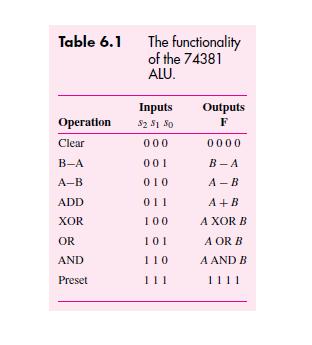

### Academic Use Policy

This code is provided for educational and portfolio purposes only. It is **not permitted** to be submitted as part of coursework, labs, or exams without proper authorization. Doing so may violate your institution's academic integrity policies.

If you're a student, feel free to study this repository to learn VHDL concepts, but **do not copy or submit this work as your own.**

# 4BitALU
Represent the functionality of a 74381 4bit ALU using VHDL. 

